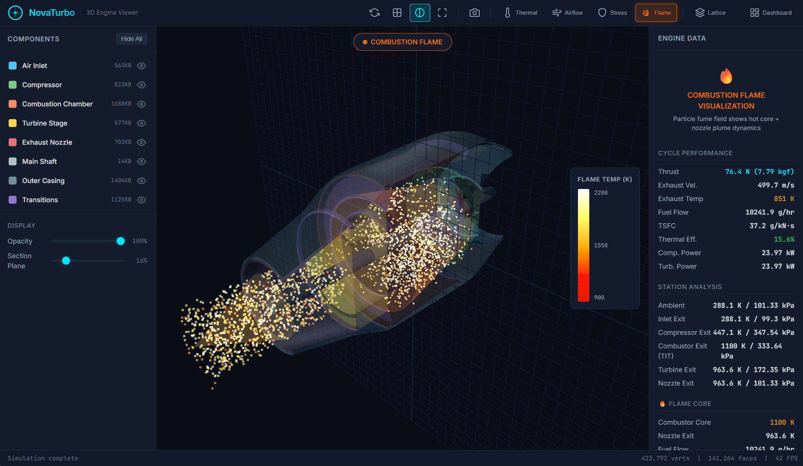

<p align="center">
  
</p>

<h1 align="center">NovaTurbo AI</h1>

<p align="center">
  <b>AI-Powered Micro Turbojet Engine Design System</b><br/>
  Inspired by <a href="https://leap71.com">LEAP 71's Noyron</a> — computational engineering for autonomous engine design
</p>

<p align="center">
  <a href="#features">Features</a> •
  <a href="#quick-start">Quick Start</a> •
  <a href="#architecture">Architecture</a> •
  <a href="#3d-viewer">3D Viewer</a> •
  <a href="#contributing">Contributing</a> •
  <a href="LICENSE">License</a>
</p>

---

## What is NovaTurbo?

NovaTurbo AI is an open-source computational engineering system that **autonomously designs micro turbojet engines** for defense-grade VTOL quadcopter drones. Given target specifications (thrust, size, weight, fuel type), it generates optimized, manufacturable engine geometries ready for **metal 3D printing (DMLS/SLM)**.

The system combines **parametric geometry generation**, **Brayton-cycle thermodynamics**, a **PyTorch neural-network surrogate model**, **NSGA-II multi-objective optimization**, and a rich **Three.js web UI** with real-time simulation visualizations.

> 🚀 **We're looking for contributors!** Especially in aerospace propulsion physics, CFD, and additive manufacturing. See [Contributing](#contributing).

## Features

| Feature | Description |
|---|---|
| 🔧 **Parametric Geometry** | 5 engine components (inlet, compressor, combustor, turbine, nozzle) with full dimensional control |
| 🌡️ **Brayton Cycle Solver** | Station-by-station thermodynamic analysis (ambient → nozzle exit) |
| 🧠 **Neural Surrogate** | MLP (144K params) trained on 10K+ design variants for instant performance prediction |
| 📊 **NSGA-II Optimizer** | Multi-objective optimization (thrust vs. weight vs. TSFC) with Pareto front |
| 🏗️ **TPMS Lattice** | Internal gyroid/Schwarz-P/diamond lattice structures via slab-warp technique |
| 🔥 **Flame Simulation** | FumeFX-style combustion particle system (3500 particles, spiral turbulence) |
| 🌈 **Thermal/Airflow/Stress** | Color-mapped simulation overlays on 3D engine geometry |
| 📐 **Engineering Dashboard** | Live parameter sliders, Brayton cycle charts, Pareto front visualization |
| 🔄 **Closed-Loop Training** | Save design variants from UI → retrain surrogate model in real-time |
| 🎯 **Inverse Design** | Specify target thrust/TSFC → AI suggests optimal geometry parameters |
| 🔬 **CFD Calibration** | Optional OpenFOAM/SU2 integration for physics-calibrated training labels |
| 📦 **STL Export** | Multi-variant STL export for Fusion 360 / 3D printing workflows |

## Quick Start

### Prerequisites
- Python 3.10+
- ~2 GB disk (for generated datasets)
- GPU optional (CPU works for inference & small training runs)

### Installation

```bash
git clone https://github.com/bxf1001g/novaturbo.git
cd novaturbo
pip install -r requirements.txt
```

### Generate Design Dataset

```bash
python app.py --generate 10000    # Generate 10K design variants (CPU: ~30 min)
```

### Train the Surrogate Model

```bash
python app.py --train --epochs 100
```

### Launch the 3D Viewer

```bash
python app.py --ui
# Open http://localhost:5000 in your browser
```

### One-Shot Design

```bash
python app.py --thrust 10 --diameter 100
```

## Architecture

```
┌─────────────────────────────────────────────────────────────┐
│                     NovaTurbo AI Pipeline                    │
├──────────────┬──────────────┬──────────────┬────────────────┤
│  Parametric  │   Physics    │   AI Engine  │  Manufacturing │
│   Geometry   │   Solver     │              │    Output      │
├──────────────┼──────────────┼──────────────┼────────────────┤
│ • Inlet      │ • Brayton    │ • Surrogate  │ • STL Export   │
│ • Compressor │   Cycle      │   (PyTorch)  │ • STEP Export  │
│ • Combustor  │ • Station    │ • NSGA-II    │ • Lattice      │
│ • Turbine    │   Analysis   │   Optimizer  │   Infill       │
│ • Nozzle     │ • CFD Bridge │ • Inverse    │ • Build Prep   │
│              │              │   Design     │                │
└──────────────┴──────────────┴──────────────┴────────────────┘
                              ↕
                    ┌──────────────────┐
                    │   Web UI (Three.js)   │
                    │ • 3D Viewer      │
                    │ • Simulations    │
                    │ • Dashboard      │
                    │ • Flame FX       │
                    └──────────────────┘
```

## Project Structure

```
novaturbo/
├── app.py                    # Main entry point (CLI)
├── requirements.txt          # Python dependencies
├── config/                   # Engine parameters, materials, constraints
├── src/
│   ├── geometry/             # Parametric engine component generators
│   │   └── lattice.py        # TPMS lattice (gyroid, Schwarz-P, diamond)
│   ├── physics/              # Thermodynamic & fluid dynamics solvers
│   │   ├── brayton.py        # Brayton cycle station analysis
│   │   └── cfd_calibration.py # OpenFOAM/SU2 calibration bridge
│   ├── ai/                   # Neural network surrogate & optimizer
│   │   ├── surrogate.py      # MLP surrogate model (PyTorch)
│   │   └── optimizer.py      # NSGA-II multi-objective optimizer
│   ├── export/               # STL/STEP export & manufacturing prep
│   └── visualization/        # Matplotlib plots & performance charts
├── ui/
│   ├── server.py             # Flask backend with REST API
│   ├── templates/viewer.html # Main 3D viewer page
│   └── static/
│       ├── js/viewer.js      # Three.js 3D engine (simulations, flame FX)
│       ├── js/dashboard.js   # Engineering dashboard logic
│       └── css/viewer.css    # UI styling
├── data/                     # Generated datasets & trained models
├── exports/                  # Output STL/STEP files
├── tests/                    # Test suite
└── notebooks/                # Jupyter exploration notebooks
```

## 3D Viewer

The web-based viewer provides:

- **Component inspector** — Click to inspect individual parts (inlet, compressor, combustor, turbine, nozzle, shaft, casing)
- **Thermal simulation** — Temperature-mapped heatmap overlay
- **Airflow simulation** — Velocity streamlines with color coding
- **Stress simulation** — Von Mises stress distribution
- **Flame simulation** — FumeFX-style combustion particles with real physics temps
- **Lattice view** — Toggle TPMS internal structure (gyroid/Schwarz-P/diamond variants)
- **Dashboard** — Adjust parameters live, view Brayton cycle charts, run inverse design
- **Section plane** — Adjustable cross-section slider
- **STL export** — Screenshot & export current design

## CFD Calibration (Optional)

NovaTurbo can optionally calibrate its fast surrogate model against high-fidelity CFD results:

```bash
# Set up OpenFOAM command template
export NOVATURBO_OPENFOAM_CMD_TEMPLATE="simpleFoam -case /tmp/novaturbo_{case_id}"

# Or SU2
export NOVATURBO_SU2_CMD_TEMPLATE="SU2_CFD /tmp/novaturbo_{case_id}.cfg"
```

Then use the **Dashboard → Run CFD Calibration** button, or enable "Use CFD labels" when training.

## Contributing

**We actively welcome contributions!** This is an ambitious project and we need help from people with expertise in:

- 🚀 **Aerospace Propulsion** — Combustion physics, turbomachinery aerodynamics, nozzle design
- 🌊 **CFD / Fluid Dynamics** — OpenFOAM/SU2 case setup, mesh generation, validation
- 🔬 **Materials Science** — High-temp alloys (Inconel, Hastelloy), additive manufacturing constraints
- 🧠 **Machine Learning** — Physics-informed neural networks, surrogate model improvements
- 🏗️ **CAD/CAM** — STEP export, build orientation optimization, support structure generation
- 🎨 **3D Visualization** — Three.js, WebGL, advanced rendering techniques

### How to Contribute

1. **Fork** the repository
2. **Create a branch** (`git checkout -b feature/your-feature`)
3. **Make your changes** and add tests
4. **Submit a Pull Request** with a clear description

See [CONTRIBUTING.md](CONTRIBUTING.md) for detailed guidelines.

### Ideas for First Contributions

- [ ] Add physics-informed loss function to surrogate training
- [ ] Implement ensemble model with uncertainty quantification
- [ ] Add active learning (auto-sample where model uncertainty is highest)
- [ ] Cross-section slicer with thermal/stress overlay
- [ ] Design comparison mode (side-by-side)
- [ ] Map CFD results back to 3D viewer as ground-truth heatmaps
- [ ] STEP file export for manufacturing
- [ ] Make flame field CFD-driven (temperature/species/velocity per voxel)
- [ ] Add more engine topologies (axial compressor, afterburner)
- [ ] Real material property databases (temp-dependent Cp, k, σ_yield)

## Engine Specifications (Default)

| Parameter | Value |
|---|---|
| Type | Single-spool micro turbojet |
| Compressor | Centrifugal, single-stage |
| Combustor | Annular |
| Turbine | Single-stage axial |
| Nozzle | Convergent |
| Thrust | ~76 N (7.8 kgf) |
| Max Diameter | 120 mm |
| Total Length | ~232 mm |
| Weight | ~1.87 kg |
| RPM | 100,000 |
| Pressure Ratio | 3.5 |
| TIT | 1100 K |
| TSFC | ~37 g/kN·s |

## License

MIT License — see [LICENSE](LICENSE) for details.

## Acknowledgments

- Inspired by [LEAP 71's Noyron](https://leap71.com) — autonomous computational engineering for rocket engines
- Built with [Three.js](https://threejs.org/), [PyTorch](https://pytorch.org/), [Flask](https://flask.palletsprojects.com/), [Chart.js](https://www.chartjs.org/)
- TPMS lattice algorithms based on triply periodic minimal surface research
